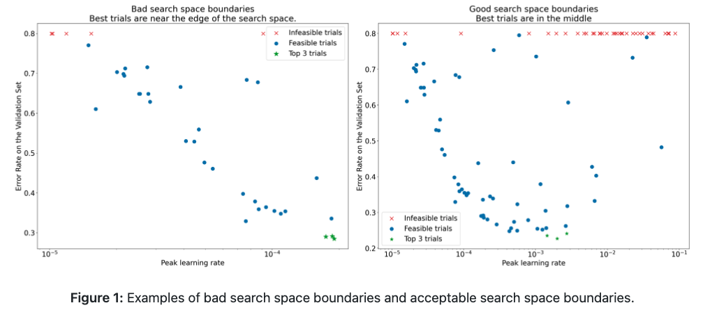
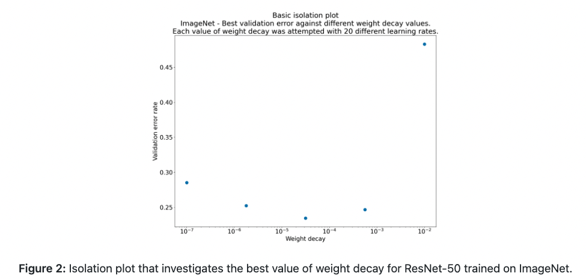

# **深度学习调参方法**

**Varun Godbole†, George E. Dahl†, Justin Gilmer†, Christopher J. Shallue‡, Zachary Nado†**

† Google Research, Brain Team

‡ Harvard University

## 开始新的工程的指南

​		许多调参的决定只在工程开始时设置，当一些条件发生变化时才会再去回顾或改变。

​		我们该部分的指南基于以下假设：

* 问题构建、数据清理等主要工作已经完成，因此，只需将时间花在模型架构和训练配置
* 已经有管道用来进行模型训练和评估，并且，对所感兴趣的不同模型都可以较容易地进行训练和预测工作
* 合适的评估标准已经选择并设置。这些应该尽可能对部署环境下的测量有代表性

### 选择合适的模型架构

***总结***：当开始一个新的工程时，试着复用已经有效果的模型

* 首先，选择一个很好构建、普遍使用的模型架构来开展工作。总是可以在后面再建立一个定制化的模型

* 模型架构一般都具有多种超参数，这些超参数决定了模型的尺寸和其他一些细节（如，层数，层宽，激活函数的类型）
  * 因此，选择一个架构，实际意味着选择一族不同模型（一组模型超参数的设置即为一族）
  * 我们将在选择初始设置和提升模型性能的科学方法中研究如何选择模型超参数的问题

*如果可能的话，试着寻找一篇与手头工作尽可能接近的论文，并复现该模型作为开始

### 选择优化器

***总结***：以对手头问题最流行的优化器来开始

* 对于所有类型的机器学习问题和模型架构，没有哪个优化器是最优的。甚至，比较不同优化器也是个困难的任务。
* 我们推荐以流行的优化器，特别是当开始一个新的工程。
  * 理想的，对相同类型的问题选择最流行的优化器

* 应对所选择的优化器的所有超参数给予重视。
  * 具有更多超参数的优化器可能需要更多的调节努力来寻找最佳设置
  * 这特别的相对在工程开始阶段，当我们寻找其他多种超参数的最佳值（如，架构超参数）而对优化器超参数为麻烦的参数
  * 也许在工程开始阶段，使用较简单的优化器（如，固定动量的SGD或固定参数的Adam）更合适，在以后再转向更一般的优化器

* 我们喜欢公认的优化器包括（但不局限于）
  * 动量SGD（我们喜欢Nesterov变种）
  * Adam和NAdam，比动量SGD更一般。注意，Adam有4个可调节超参数。

### 选择batch size

***总结***：batch size控制着训练速度，不应被用于直接调节验证集的性能。通常，理想的batch size是现有硬件所支持的最大的batch size。
* batch size是决定训练时间和计算资源消耗的关键参数
* 增加batch size通常可以降低训练时间。这是非常有用的，因为
  * 在固定的时间间隔内，使得超参数可以被调节更多次，潜在地导致更好的最终模
  * 减小开发周期的等待时间，使得新的idea能够更频繁地被测试

* 增加batch size可能会降低、增加或不改变资源消耗
* batch size不该被视作用于改变验证集性能的可调节超参数
  * 只要所有超参数已经被很好地调节（特别是学习速率和正则化超参数），以及训练步数是足够的，那么，对于任意batch size都能得到相同的最终性能(Shallue et al. 2018)
  * 可以查看为什么不应该直接调节batch size 来提升验证集的性能

#### 确定可行的batch size和估计训练吞吐量(throughput)

* 对于给定的模型和优化器，现有硬件一般支持一定范围的batch size。这限制因素通常为内存
* 不幸的是，不进行运行或编译完整的训练程序，是很难计算适合内存的batch size
* 最简单的解决方法，通常是用较少步数分别训练一系列不同batch size，直到其中一个job超过了现有内存
* 对于每个batch size，我们应该训练足够长的时间来获得对训练吞吐量的可靠估计。

   ​	训练吞吐量 =（ 每秒处理的样本数） 或 （每个step所需时间）

   ​	每个step所需时间 = （batch size）/ （训练吞吐量）

* 当加速器还没达到饱和，如果加倍batch size，则训练吞吐量也应加倍（或至少接近加倍）。相当于，当batch size增加，每一步的时长应为恒值（至少近似恒值）
* 如果不是这种情况，那么训练管道会有其他瓶颈，如，IO或在计算节点间的同步。这值得在下一步进行之前先诊断和修正。
* 如果训练吞吐量只在一定大的batch size会增加，那么，我们只考虑这种大小batch size，即使硬件支持更大的batch size
  * 使用更大的batch size的好处是基于训练吞吐量会增加。如果没有满足这种假设，那么应修复这些瓶颈或使用更小的batch size
  * **梯度累加**模拟比硬件支持的最大batch size，因此，不会得到任何吞吐量的好处。这一般在实际工作中应避免。

* 这些步骤可能在每次模型或优化器发生改变时都要重复进行（如，不同的模型架构可能运行更大的batch size适合内存）

 

#### 选择batch size来使得训练时间最小化

训练时长 = （每个step时长）* （总step数）

* 我们通常可以认为，对于所有可行的batch size，每个step的时间都是近似恒定的。当并行计算没有开销并且所有训练瓶颈都已被诊断和纠正时，这是正确的。实际上，增加batch size通常至少会产生一些开销。

* 随着batch size的增加，达到固定性能目标所需的步数通常会减少（Shallue et al. 2018 给出了当batch size发生改变时，重调所有相关超参数的方法）
  * 例如，加倍batch size可能会使得所需步数减半。这被称为是完美尺度化。
  * 在达到临界batch size之前，完美尺度化对所有batch size都是成立的；超过该临界值后，得到的回报将递减
  * 最终，增加batch size不再减少训练所需步数（但从不会增加步数）

* 因此，最小化训练时间的batch size，通常是最大的batch size仍能减小所需的训练步数。
  * 这个批量大小取决于数据集、模型和优化器，除了通过实验为每个新问题找到它之外，如何计算它是一个悬而未决的问题
  * 当比较不同batch size时，需注意单个样本开销/epoch开销(当固定训练样本数时训练所有实验)和单个step的开销(固定训练步数来训练所有实验)
    * 将批量大小与 epoch 预算进行比较只会探索完美的扩展机制，即使更大的批量大小仍可能通过减少所需的训练步骤数来提供有意义的加速
  * 通常，硬件所支持的最大batch size会比临界batch size要小一些。因此，好的做法是（没有跑任何实验）尽可能使用最大的batch size。

1. 如果最终会增加训练时间，那么使用更大的批量大小是没有意义的

#### 选择使得资源开销最小化的batch size

* 伴随着batch size的增加，有两种类型的资源开销
* 如果增加批量大小的前期成本很高，那么最好推迟增加批量大小，直到项目成熟并且更容易评估成本效益权衡。 实施多主机并行训练程序可能会引入错误和细微问题，因此最好从更简单的管道开始。 （另一方面，在需要大量调整实验的过程早期，训练时间的大幅加快可能非常有益）
* 我们将总的使用成本（可能包括多种不同的成本）称为“资源消耗”。 我们可以将资源消耗分解为以下组成部分：

   资源消耗 = （每个step的资源消耗）* （总step数量）
* 增加batch size通常可以让我们减少总步数。 资源消耗是增加还是减少将取决于每步消耗如何变化
  * 增加批大小可能会减少资源消耗。 例如，如果具有较大batch size的每个step都可以在与较小批量大小相同的硬件上运行（每个step的时间只增加一点点），那么每个step资源消耗的增加可能会被步数上的减少所抵消。
  * 增加batch size可能不会改变资源消耗。例如，如果加倍batch size来使所需step减半和加倍所需GPU数量，那么总的消耗（GPU小时）不会改变。
  * 增加batch size可能增加资源消耗。例如，如果增加batch size会需要升级硬件，每个step的消耗的增加可能会被step数量的减少而抵消。

#### 改变batch size会需要重调大部分超参数

* 大部分超参数的最优值都是对batch size敏感的。因此，当改变batch size时，一般都需要重新调参
* 和batch size相关性最强的超参数是优化器超参数（如，学习速率和动量）和正则化超参数，因此，需要对每个batch size单独调参。
* 在项目开始时选择批量大小时请记住这一点。 如果您以后需要切换到不同的批量大小，则为新的批量大小重新调整所有内容可能会很困难、耗时且昂贵。

#### Batch norm如何与batch size相互影响

​	Batch norm 很复杂，一般来说，应该使用与梯度计算不同的 batch size 来计算统计数据。 有关详细讨论，请参阅batch norm部分

### 选择初始配置

* 在开始进行超参数调参前，必须先确定开始点。这包含确定，(1)模型配置(如，层数)，(2) 优化器超参数(如，学习速率)，(3) 训练步数
* 确定此初始配置将需要一些手动配置的训练运行和反复试验
* 我们的指导原则是找到一种简单、相对快速、相对低资源消耗的配置，以获得“合理”的结果  
  * “简单”意味着尽可能避免花里胡哨的东西； 这些总是可以在以后添加。 即使花里胡哨的东西在未来被证明是有用的，但在初始配置中添加它们可能会浪费时间调整无用的功能和/或烘烤不必要的并发症。**如，在添加花哨的decay schedules之前，以恒定的学习速率开始**
  * 选择快速且消耗最少资源的初始配置将使超参数调整更加高效。**如，以较小的模型开始**
  * “合理”性能取决于问题，但至少意味着经过训练的模型在验证集上的性能比随机机会好得多（尽管它可能很糟糕，不值得部署）
* 选择训练步数涉及到平衡以下方面：
  * 一方面，训练更多的步数，可以提升性能，使得超参数调节变得更容易
  * 另一方面，使用更少的步数训练，可以使得每次训练更快和使用更少的资源，通过减少循环之间的时间并允许并行运行更多实验来提高调优效率。 此外，如果最初选择了一个不必要的大步预算，可能很难在以后改变它，例如 一旦针对该步数调整了学习率计划

## 提升模型性能的科学方法

就本文档而言，机器学习开发的最终目标是最大化已部署模型的效用。 尽管开发过程的许多方面因应用程序而异（例如时间长度、可用计算资源、模型类型），但我们通常可以在任何问题上使用相同的基本步骤和原则。  
下面的指南做了以下假设：

* 已经有一个能够完整运行的训练pipeline并能够得到合理结果的配置
* 有足够的计算资源可用于进行有意义的调整实验并并行运行至少多个训练作业

### 增量调节策略

***总结***：从简单的配置开始，逐步进行改进，同时深入了解问题。 确保任何改进都基于强有力的证据，以避免增加不必要的复杂性。

* 我们的最终目标是找到一个能最大化我们模型性能的配置
  * 在某些情况下，我们的目标是在固定的截止日期前最大限度地改进模型（例如提交竞赛）。
  * 在其他情况下，我们希望无限期地改进模型（例如，不断改进生产中使用的模型）。
* 原则上，我们可以通过使用算法自动搜索可能配置的整个空间来最大化性能，但这不是一个实用的选择。
  * 可能配置的空间非常大，目前还没有任何算法足够复杂，可以在没有人工指导的情况下有效地搜索这个空间
* 大多数自动搜索算法都依赖于手动设计的搜索空间，该搜索空间定义了要搜索的配置集，这些搜索空间可能非常重要。
* 最大化性能的最有效方法是从简单的配置开始，逐步添加功能并进行改进，同时深入了解问题
  * 我们在每一轮调整中都使用自动搜索算法，并随着我们理解的增长不断更新我们的搜索空间
* 随着我们的探索，我们自然会找到越来越好的配置，因此我们的“最佳”模型将不断改进。
  * 当我们更新我们的最佳配置时，我们将其称为一次**发布**（这可能对应于也可能不对应于生产模型的实际发布）。
  * 对于每次发布，我们必须确保更改是基于强有力的证据——而不仅仅是基于幸运配置的随机机会——这样我们就不会给训练管道增加不必要的复杂性。

在高层次上，我们的增量调优策略涉及重复以下四个步骤：

1. 为下一轮实验确定范围适当的目标。
2. 设计并运行一组实验，朝着这个目标取得进展。
3. 从结果中了解我们能做什么。
4. 考虑是否推出新的最佳配置。  

本节的其余部分将更详细地考虑该策略

### 探索与开发（Exploration vs exploitation）

***总结***：大多数时候，我们的主要目标是深入了解问题

* 尽管有人可能认为我们会花费大部分时间来尝试最大化验证集的性能，但实际上我们花费了大部分时间来尝试深入了解问题，而贪婪地关注验证误差的时间相对较少。
  * 也就是说，我们大部分时间都花在了“探索”上，只有一小部分时间花在了“开发”上。
* 从长远来看，如果我们想最大化我们的最终表现，理解问题是至关重要的。 将洞察力置于短期收益之上可以帮助我们：
  * 避免只是在历史事件中偶然好的性能，就发布不必要的更改
  * 确定验证误差对哪些超参数最敏感，哪些超参数交互最多，因此需要一起重新调整，以及哪些超参数对其他变化相对不敏感，因此可以在未来的实验中修复。
  * 建议尝试使用潜在的新功能，例如，在出现过拟合问题时使用新的正则化。
  * 确定无用的特征，因此可以将其删除，从而降低未来实验的复杂性。
  * 识别来自超参数调整的改进何时可能已经饱和。
  * 围绕最佳值缩小我们的搜索空间，以提高调整效率。
* 当我们最终准备好变得贪婪时，我们可以完全关注验证误差，即使实验没有提供关于调优问题结构的最大信息

### 选择下一轮实验的目标

***总结***：每轮实验都应该有一个明确的目标，并且范围要足够窄，这样实验才能真正朝着目标取得进展

* 每轮实验都应该有一个明确的目标，并且范围要足够窄，这样实验才能真正朝着目标取得进展：如果我们试图一次添加多个特征或回答多个问题，我们可能无法理清每个对结果的影响。
* 示例目标包含：
  * 尝试对管道进行潜在的改进（例如，新的正则化器、预处理选择等）。
  * 了解特定模型超参数（例如激活函数）的影响
  * 贪婪地最大化验证错误。

### 设计下一轮实验

***总结***：确定哪些超参数对于实验目标而言是科学的、冗余的和固定的超参数。 创建一系列研究以比较科学超参数的不同值，同时优化麻烦的超参数。 选择冗余的超参数的搜索空间以平衡资源成本与科学价值。

#### 识别科学的、冗余的和固定的超参数

* 对于给定的目标，所有超参数要么是科学超参数，要么是冗余超参数，要么是固定超参数。
  * 科学超参数是那些对我们试图衡量的模型性能有影响的参数。
  * 冗余的超参数是那些需要优化的超参数，以便公平地比较科学超参数的不同值。 这类似于冗余参数的统计概念。
  * 固定超参数将在当前轮次实验中固定其值。 在比较科学超参数的不同值时，这些超参数的值不需要（或者我们不希望它们）改变。
    * 通过为一组实验固定某些超参数，我们必须接受从实验得出的结论可能对固定超参数的其他设置无效。 换句话说，固定的超参数对我们从实验中得出的任何结论提出警告
* 例如，如果我们的目标是“确定具有更多隐藏层的模型是否会减少验证误差”，那么隐藏层数就是一个科学的超参数。
  * 学习率是一个冗余的超参数，因为如果对每个层数分别调整学习率（最佳学习率通常取决于模型架构），我们只能公平地比较具有不同隐藏层数的模型。
  * 如果我们在之前的实验中确定激活函数的最佳选择对模型深度不敏感，或者如果我们愿意限制我们关于隐藏层数量的结论以仅涵盖该特定选择，则激活函数可以是一个固定的超参数。 或者，如果我们准备为每个隐藏层数单独调整它，它可能是一个冗余的参数。
* 一个特定的超参数是科学超参数、冗余超参数还是固定超参数并不是该超参数固有的，而是根据实验目标而变化的。
  * 例如，激活函数的选择可以是一个科学的超参数（对于我们的问题，ReLU 或 tanh 是更好的选择吗？），一个冗余的超参数（当我们允许多个模型时，最好的 5 层模型是否优于最好的 6 层模型？ 不同的可能激活函数？），或固定的超参数（对于 ReLU 网络，在特定位置添加批量归一化是否有帮助？）
* 在设计新一轮实验时，我们首先确定我们实验目标的科学超参数。
  * 在此阶段，我们将所有其他超参数视为冗余的超参数。
* 接下来，我们将一些冗余的超参数转换为固定超参数。
  * 如果有了无限的资源，我们会将所有非科学的超参数保留为冗余的超参数，这样我们从实验中得出的结论就不会受到关于固定超参数值的警告。
  * 然而，我们尝试调整的冗余的超参数越多，我们无法针对科学超参数的每个设置充分调整它们并最终从我们的实验中得出错误结论的风险就越大。
    * 如下所述，我们可以通过增加计算预算来应对这种风险，但通常我们的最大资源预算少于调整所有非科学超参数所需的资源预算。
  * 我们选择将一个冗余的超参数转换为一个固定的超参数，根据我们的判断，固定它所引入的警告比将它作为一个冗余的超参数包含在内的成本要小。
  * 给定的冗余超参数与科学超参数的交互越多，固定其值的破坏性就越大。 例如，权重衰减强度的最佳值通常取决于模型大小，因此假设权重衰减的单个特定值以比较不同的模型大小不会很有见地。
* 尽管我们分配给每个超参数的类型取决于实验目标，但我们对某些类别的超参数有以下经验法则：
  * 在各种优化器超参数（例如学习率、动量、学习率调度参数、Adam beta 等）中，至少其中一些是冗余的超参数，因为它们往往与其他变化的交互作用最大。
    * 它们很少是科学超参数，因为像“当前管道的最佳学习率是多少？”这样的目标。 没有给出太多的见解——最好的设置很容易随着下一次管道的改变而改变。
    * 尽管由于资源限制或当我们有特别有力的证据表明它们不与科学参数相互作用时，我们可能偶尔会修复其中一些，但我们通常应该假设优化器超参数必须单独调整以在不同设置之间进行公平比较 科学的超参数，因此不应该被固定。
      * 此外，我们没有先验理由偏爱一个优化器超参数值而不是另一个（例如，它们通常不会以任何方式影响前向传递或梯度的计算成本）
  * 相比之下，优化器的选择通常是科学超参数或固定超参数。
    * 如果我们的实验目标涉及在两个或多个不同的优化器之间进行公平比较（例如“确定哪个优化器在给定的步骤数中产生最低的验证错误”），那么它就是一个科学的超参数。
    * 或者，我们可能出于各种原因将其设为固定的超参数，包括（1）先前的实验使我们相信针对我们问题的最佳优化器对当前的科学超参数不敏感； 和/或（2）我们更喜欢使用这个优化器来比较科学超参数的值，因为它的训练曲线更容易推理； 和/或 (3) 我们更喜欢使用这个优化器，因为它比其他优化器使用更少的内存。
  * 正则化技术引入的超参数通常是冗余的超参数，但我们是否完全包括正则化技术是一个科学的或固定的超参数。
    * 例如，dropout 增加了代码的复杂性，因此在决定是否包含它时，我们会将“no dropout”与“dropout”作为一个科学的超参数，而将 dropout 率作为一个冗余的超参数。
      * 如果我们决定根据这个实验将 dropout 添加到我们的管道中，那么在未来的实验中，dropout 率将是一个冗余的超参数。
  * 架构超参数通常是科学的或固定的超参数，因为架构变化会影响服务和训练成本、延迟和内存需求。
    * 例如，层数通常是一个科学的或固定的超参数，因为它往往会对训练速度和内存使用产生巨大影响。
* 在某些情况下，干扰和固定超参数集将取决于科学超参数的值。
  * 例如，假设我们试图确定 Nesterov momentum 和 Adam 中哪个优化器的验证错误率最低。 科学超参数是优化器，它取值 {"Nesterov_momentum", "Adam"}。 值 optimizer="Nesterov_momentum" 引入了干扰/固定超参数 {learning_rate, momentum}，但值 optimizer="Adam" 引入了干扰/固定超参数 {learning_rate, beta1, beta2, epsilon}。
  * 仅针对科学超参数的某些值存在的超参数称为**条件超参数**。
  * 我们不应该仅仅因为两个条件超参数具有相同的名称就认为它们是相同的！ 在上面的示例中，名为 learning_rate 的条件超参数是 optimizer="Nesterov_momentum" 与 optimizer="Adam" 的不同超参数。 它在两种算法中的作用相似（尽管不完全相同），但在每个优化器中运行良好的值范围通常相差几个数量级。

#### 创建一组研究

* 一旦我们确定了科学和冗余的超参数，我们就会设计一个“研究”或一系列研究，以朝着实验目标取得进展。
  * 一项研究指定了一组要运行的超参数配置以供后续分析。 每个配置称为“试验”。
  * 创建研究通常涉及选择在试验中会有所不同的超参数，选择这些超参数可以采用的值（“搜索空间”），选择试验次数，以及选择自动搜索算法以从搜索空间中抽取那么多试验。 或者，我们可以通过手动指定一组超参数配置来创建研究
* 研究的目的是使用不同的科学超参数值运行管道，同时“优化掉”（或“优化”）冗余的超参数，以便科学超参数的不同值之间的比较是尽可能公平的。
* 在最简单的情况下，我们将对科学参数的每个配置进行单独研究，其中每个研究都会调整冗余的超参数。
  * 例如，如果我们的目标是从 Nesterov momentum 和 Adam 中选择最佳优化器，我们可以创建一个研究，其中 optimizer="Nesterov_momentum" 和冗余的超参数是 {learning_rate, momentum}，以及另一个研究，其中 optimizer=" Adam”和冗余的超参数是 {learning_rate, beta1, beta2, epsilon}。 我们将通过从每项研究中选择表现最好的试验来比较这两个优化器。
  * 我们可以使用任何无梯度优化算法，包括贝叶斯优化或进化算法等方法来优化多余的超参数，尽管我们更喜欢在调整的探索阶段使用准随机搜索，因为它具有多种优势 在此设置中。 探索结束后，如果有最先进的贝叶斯优化软件可用，那是我们的首选。
* 在更复杂的情况下，我们想要比较大量科学超参数的值，而进行那么多独立研究是不切实际的，我们可以将科学参数包含在与冗余超参数相同的搜索空间中，并使用搜索算法 在单个研究中对科学超参数和冗余超参数的值进行采样。
  * 采用这种方法时，条件超参数可能会导致问题，因为很难指定搜索空间，除非冗余超参数集对于科学超参数的所有值都相同。
  * 在这种情况下，我们更倾向于使用准随机搜索而不是更高级的黑盒优化工具，因为它确保我们获得相对均匀的科学超参数值采样。 无论搜索算法如何，我们都需要以某种方式确保它统一搜索科学参数。

#### 在信息丰富和负担得起的实验之间取得平衡

* 在设计一项研究或一系列研究时，我们需要分配有限的预算，以充分实现以下三个要求：
  1. 比较科学超参数的足够多的不同值。
  2. 在足够大的搜索空间上调整冗余的超参数。
  3. 对有害超参数的搜索空间进行密集采样
* 我们越能实现这三个必要条件，我们就能从实验中获得越多的洞察力。
  * 尽可能多地比较科学超参数的值可以拓宽我们从实验中获得的见解的范围。
  * 包括尽可能多的无用超参数并允许每个冗余超参数在尽可能宽的范围内变化可以增加我们的信心，即在科学超参数的每个配置的搜索空间中存在冗余超参数的“好”值。
    * 否则，我们可能会通过不搜索冗余参数空间的可能区域来对科学超参数的值进行不公平的比较，在这些区域中，科学参数的某些值可能有更好的值
  * 尽可能密集地对冗余超参数的搜索空间进行采样增加了我们的信心，即搜索过程会找到恰好存在于我们的搜索空间中的冗余超参数的任何良好设置。
    * 否则，我们可能会在科学参数的值之间进行不公平的比较，因为一些值随着冗余的超参数的采样而变得更幸运。
* 不幸的是，这三个维度中任何一个的改进都需要增加试验次数，从而增加资源成本，或者找到一种方法来节省其他维度之一的资源。
  * 每个问题都有自己的特性和计算限制，因此如何在这三个需求之间分配资源需要一定程度的领域知识。
  * 在进行一项研究后，我们总是试图了解该研究是否对冗余的超参数进行了足够好的调整（即搜索了足够大的空间，足够广泛）以公平地比较科学超参数（如下面更详细的描述）。

### 从试验结果中获取洞察力

***总结***：*除了努力实现每组实验的最初科学目标外，还要有检查额外问题的清单，如果发现问题，修改实验并重新运行*。

* 最终，每组实验都有一个特定的目标，我们想要评估实验为该目标提供的证据。
  * 然而，如果我们提出正确的问题，我们通常会发现在一组给定的实验能够朝着最初的目标取得很大进展之前需要纠正的问题。
    * 如果我们不提出这些问题，可能会得到不正确的答案
  * 由于运行实验的成本很高，我们还希望借此机会从每组实验中提取其他有用的见解，即使这些见解与当前目标并不直接相关。
* 在分析一组给定的实验以朝着最初的目标取得进展之前，我们应该问自己以下额外的问题：
  * 搜索空间是否足够大？
    * 如果研究的最佳点在一维或多维搜索空间的边界附近，则搜索可能不够广泛。 在这种情况下，我们应该进行另一项扩展后搜索空间的研究。
  * 我们是否从搜索空间中采样了足够多的点？
    * 如果没有，则运行更多的点，或者降低调节目标的期望。
  * 每项研究中有多少试验是不可行的（即出现分歧的试验，得到非常糟糕的损失值，或者因为它们违反了某些隐式约束而根本无法运行）？
    * 当研究中的很大一部分点不可行时，我们应该尝试调整搜索空间以避免对这些点进行采样，这有时需要重新参数化搜索空间。
    * 在某些情况下，大量不可行点可能表示训练代码中存在错误。
  * 该模型是否存在优化问题？
  * 我们可以从最佳试验的训练曲线中学到什么？
    * 例如，最好的试验是否具有与有问题的过度拟合一致的训练曲线？
* 如有必要，根据上述问题的答案，改进最近的研究（或研究组）以改进搜索空间和/或抽样更多试验，或采取其他一些纠正措施。
* 一旦我们回答了上述问题，我们就可以继续评估实验为我们最初的目标提供的证据（例如，评估更改是否有用）。

#### 识别差的搜索空间边界

* 如果从中采样的最佳点靠近其边界，则搜索空间是可疑的。 如果我们朝那个方向扩大搜索范围，我们可能会找到更好的点。
* 为了检查搜索空间边界，我们喜欢在我们称之为基本超参数轴图的地方绘制完成的试验，我们在其中绘制验证目标值与其中一个超参数（例如学习率）的关系。 图中的每个点都对应于一次试验。
  * 每次试验的验证目标值通常应该是它在训练过程中获得的最佳值。

* 图 1 中的图表显示了误差率（越低越好）与初始学习率的关系。
* 如果最佳点聚集到搜索空间的边缘（在某个维度上），则可能需要扩展搜索空间边界，直到最佳观察点不再靠近边界。
* 通常，一项研究将包括“不可行”的试验，这些试验会产生分歧或得到非常糟糕的结果（在上图中用红色 X 标记）。
  * 如果学习率大于某个阈值的所有试验都不可行，并且如果表现最好的试验的学习率处于该区域的边缘，则该模型可能会遇到稳定性问题，从而无法获得更高的学习率。

#### 没有在搜索空间内采样足够多的点

* 通常，很难知道搜索空间的采样是否足够密集。 🤖
* 运行更多的试验当然更好，但代价是显而易见的。
* 由于很难知道我们什么时候采样足够，我们通常会采样我们可以负担得起的东西，并尝试通过反复查看各种超参数轴图来校准我们的直觉信心，并试图了解有多少点处于搜索空间的“良好”区域。

#### 检查训练曲线

***总结***：检查训练曲线是识别常见故障模式的一种简单方法，可以帮助我们确定下一步优先采取什么行动。

* 虽然在许多情况下，我们实验的主要目标只需要考虑每次试验的验证误差，但在将每次试验数量减少到个位数时我们必须小心，因为它可以隐藏有关表面下发生的事情的重要细节。
* 对于每项研究，我们总是至少查看少数最佳试验的训练曲线（绘制的训练误差和验证误差与训练期间训练步骤的关系）。
* 即使这不是解决主要实验目标所必需的，检查训练曲线也是识别常见失败模式的一种简单方法，并且可以帮助我们确定下一步优先采取什么行动。
* 在检查训练曲线时，我们对以下问题感兴趣。
* 是否有任何试验表现出有问题的过度拟合？
  * 当验证错误在训练期间的某个时刻开始增加时，就会出现有问题的过度拟合。
  * 在我们通过为每个科学超参数设置选择“最佳”试验来优化多余超参数的实验设置中，我们应该至少在每个与我们所比较的科学超参数设置相对应的最佳试验中检查有问题的过度拟合。
    * 如果任何最佳试验出现过拟合问题，我们通常希望在比较科学超参数的值之前使用额外的正则化技术重新运行实验和/或更好地调整现有的正则化参数。
      * 如果科学超参数包括正则化参数，这可能不适用，因为如果这些正则化参数的低强度设置导致有问题的过度拟合，也就不足为奇了。
    * 使用常见的正则化技术减少过度拟合通常很简单，这些技术会增加最小的代码复杂性或额外的计算（例如丢失、标签平滑、权重衰减），因此在下一轮实验中添加一个或多个这些通常没什么大不了的。
    * 例如，如果科学超参数是“隐藏层数”，并且使用最大隐藏层数的最佳试验表现出过拟合问题，那么我们通常更愿意使用额外的正则化再次尝试，而不是立即选择较小数量的 隐藏层。
    * 即使“最佳”试验都没有表现出有问题的过度拟合，如果它出现在其他任何试验中，也可能仍然存在问题。
      * 选择最佳试验会抑制出现过拟合问题的配置，并偏向那些不会出现过拟合问题的配置。 换句话说，它将支持具有更多正则化的配置。
      * 然而，任何让训练变得更糟的事情都可以作为正则化器，即使它不是故意的。 例如，选择较小的学习率可以通过阻碍优化过程来规范训练，但我们通常不希望以这种方式选择学习率。
      * 因此，我们必须意识到，科学超参数的每个设置的“最佳”试验可能会以有利于某些科学或冗余的超参数的“坏”值的方式选择。
* 训练后期的训练或验证误差是否存在高步进方差（high step-to-step variance）？
  * 如果是这样，这可能会干扰我们比较科学超参数的不同值的能力（因为每个试验随机地以“幸运”或“不幸”步骤结束）以及我们在生产中重现最佳试验结果的能力（因为 生产模型可能不会以与研究中相同的“幸运”步骤结束）。
  * 步进方差的最可能原因是批次方差（从每个批次的训练集中随机抽取示例）、小验证集以及在训练后期使用过高的学习率。
  * 可能的补救措施包括增加批量大小、获取更多验证数据、使用学习率衰减或使用 Polyak 平均。
* 训练结束时试验是否仍在改进？
  * 如果是这样，这表明我们处于“计算限制”状态，我们可能会从增加训练步骤数或改变学习率计划中受益。
* 训练集和验证集的性能在最后的训练步骤之前很早就饱和了吗？
  * 如果是这样，这表明我们处于“不受计算限制”的状态，并且我们可以减少训练步骤的数量。
* 虽然我们不能一一列举，但还有许多其他行为可以通过检查训练曲线变得明显（例如，训练过程中训练损失增加通常表明训练管道中存在错误）。

#### 使用隔离图（isolation plots）检测更改是否有用

* 通常，一组实验的目标是比较科学超参数的不同值。
  * 例如，我们可能想要确定导致最佳验证误差的权重衰减值。
* 隔离图是基本超参数轴图的特例。 隔离图上的每个点都对应于某些（或所有）冗余超参数的最佳试验的性能。
  * 换句话说，我们绘制了“优化掉”冗余超参数后的模型性能。
* 隔离图可以更轻松地在科学超参数的不同值之间进行同类比较。
* 例如，图 2 揭示了权重衰减的值，它为在 ImageNet 上训练的 ResNet-50 的特定配置产生最佳验证性能。
  * 如果我们的目标是确定是否完全包括权重衰减，那么我们会将此图中的最佳点与没有权重衰减的基线进行比较。 为了公平比较，基线的学习率也应该同样得到很好的调整。
* 当我们有（准）随机搜索生成的数据并考虑隔离图的连续超参数时，我们可以通过对基本超参数轴图的 x 轴值进行分桶并在由桶定义的每个垂直切片中进行最佳试验来近似隔离图。

#### 自动化一般有用的图

* 生成图上的花的功夫越多，我们就越不可能尽可能多地查看它们，因此我们有必要设置我们的基础设施以自动生成尽可能多的图。
* 至少，我们会为我们在实验中变化的所有超参数自动生成基本超参数轴图。
* 此外，我们会自动为所有试验生成训练曲线，并尽可能轻松地找到每项研究中最好的少数试验并检查它们的训练曲线。
* 我们可以添加许多其他有用的潜在图表和可视化。 尽管上面描述的是一个很好的起点，但套用杰弗里·辛顿 (Geoffrey Hinton) 的话，“每次设计新事物时，您都会学到新事物。”

### 确定是否采用训练管道更改或超参数配置

***总结***：在决定是否更改我们的模型或训练程序或采用新的超参数配置时，我们需要了解结果的不同来源。

* 当我们尝试改进我们的模型时，我们可能会观察到与现有配置相比，特定的候选更改最初实现了更好的验证误差，但发现在重复实验后并没有一致的优势。 非正式地，我们可以将可能导致这种不一致结果的最重要的变异来源分为以下几大类：
  * **训练过程方差、再训练方差或试验方差**：我们在使用相同超参数但使用不同随机种子的训练运行之间看到的差异。
    * 例如，不同的随机初始化、训练数据shuffle、丢弃掩码、数据扩充操作的模式以及并行算术操作的顺序，都是试验方差的潜在来源。
  * **超参数搜索方差或研究方差**：由我们选择超参数的程序引起的结果变化。
    * 例如，我们可能会在特定搜索空间运行相同的实验，但使用两个不同的种子进行准随机搜索，并最终选择不同的超参数值。
  * **数据收集和抽样方差**：来自任何种类的随机拆分为训练、验证和测试数据的方差，或更普遍的训练数据生成过程引起的方差。
* 比较使用严格的统计测试在有限验证集上估计的验证误差率是很好的，但通常单独的试验方差可以在使用相同超参数设置的两个不同训练模型之间产生统计显著差异。
* 当我们试图得出超出超参数空间中单个点水平的结论时，我们最关心的是研究方差。
  * 研究方差取决于试验次数和搜索空间，我们已经看到它大于试验方差的情况以及它小得多的情况。
* 因此，在采用候选更改之前，请考虑将最佳试验运行 N 次以表征每次运行的试验方差。
  * 通常，我们可以在对管道进行重大更改后仅重新表征试验方差，但在某些应用中，我们可能需要更新的估计值。
  * 在其他应用中，表征试验方差的成本太高，不值得。
* 归根结底，虽然我们只想采用能够产生真正改进的更改（包括新的超参数配置），但要求完全确定某些东西有帮助也不是正确的答案。
* 因此，如果一个新的超参数点（或其他变化）得到比基线更好的结果（尽可能考虑新点和基线的再训练方差），那么我们可能应该采用它作为新的基线 为以后的比较。
  * 但是，我们应该只采用产生的改进超过它们增加的任何复杂性的更改。

### 探索后的总结

***总结***：一旦我们完成了对良好搜索空间的探索并决定了应该调整哪些超参数，贝叶斯优化工具就是一个引人注目的选择。

* 在某个时候，我们的优先事项将从更多地了解调优问题迁移到生成单一最佳配置以启动或以其他方式使用。
* 在这一点上，应该有一个精确的搜索空间，可以舒适地包含最佳观察试验周围的局部区域，并且已经过充分采样。
* 我们的探索工作应该已经揭示了最重要的要调整的超参数（以及它们的合理范围），我们可以使用这些超参数来构建搜索空间，以使用尽可能大的调整预算进行最终的自动调整研究。
* 由于我们不再关心最大化我们对调优问题的洞察力，因此准随机搜索的许多优势不再适用，应该使用贝叶斯优化工具来自动找到最佳超参数配置。
  * 如果搜索空间包含大量发散点（获得 NaN 训练损失或甚至训练损失比均值差很多标准差的点），使用黑盒优化工具来正确处理发散试验很重要（请参阅 Bayesian Optimization with Unknown Constraints 是处理此问题的绝佳方法）。
* 此时，我们还应该考虑检查测试集上的性能。
  * 原则上，我们甚至可以将验证集折叠到训练集中，并重新训练通过贝叶斯优化找到的最佳配置。 但是，这仅适用于未来不会针对此特定工作负载发布的情况（例如一次性 Kaggle 竞赛）。

## 确定每次训练运行的步数

* 有两种类型的工作负载：计算密集型(compute-bound)和非计算密集型工作负载。
* 当训练为**计算密集型**时，训练受我们愿意等待多长时间的限制，而不是受我们拥有多少训练数据或其他因素的限制。
  * 在这种情况下，如果我们能够以某种方式训练更长时间或更高效，我们应该会看到更低的训练损失，并且通过适当的调整，可以改善验证损失。
  * 换句话说，加快训练就等同于改进训练，“最佳”训练时间永远是“只要我们能负担得起”。
  * 也就是说，仅仅因为工作负载受计算限制并不意味着更长/更快的训练是改善结果的唯一途径。
* 当训练为**非计算密集型**时，即我们可以负担得起训练的时间，只要我们愿意，并且在某些时候，更长时间的训练并没有多大帮助（甚至会导致有问题的过度拟合）。
  * 在这种情况下，我们应该期望能够训练到非常低的训练损失，训练时间更长可能会略微减少训练损失，但不会显着减少验证损失。
  * 特别是当训练为非计算密集型时，更充足的训练时间预算可以使调整更容易，特别是在调整学习率衰减计划时，因为它们与训练预算有特别强的相互作用。
    * 换句话说，非常有限的训练时间预算可能需要将学习率衰减计划调整到完美，以实现良好的误差率。
* 无论给定的工作负载是否受计算限制，增加梯度方差（跨批次）的方法通常会导致训练进度变慢，因此可能会增加达到特定验证损失所需的训练步骤数。 高梯度方差可能由以下原因引起：
  * 使用较小的批量大小
  * 添加数据扩充
  * 添加某些类型的正则化（例如 dropout）

### 当训练为非计算密集型时确定训练多长时间

* 我们的主要目标是确保我们训练足够长的时间以使模型达到最佳结果，同时避免在训练步骤的数量上过度浪费。
* 如有怀疑是否达到最佳结果，宁可延长训练时间。 假设追溯（最佳）检查点选择被正确使用并且检查点足够频繁，那么在训练时间更长时性能永远不会降低。
* 切勿在研究中调整 max_train_steps 数值。 选择一个值并将其用于所有试验。 从这些试验中，绘制回顾性检查点选择找到的训练步骤，以优化 max_train_steps 的选择。
  * 例如，如果最佳步骤总是在训练的前 10% 期间，那么最大步骤数就太高了。
  * 或者，如果最佳步骤始终出现在最后 25% 的训练中，我们可能会受益于更长时间的训练和重新调整衰减时间表。
* 当架构或数据发生变化（例如添加数据扩充）时，理想的训练步骤数可能会发生变化。
* 下面我们将描述如何根据使用恒定学习率“完美适应”训练集所需的步数，为 max_train_steps 选择初始候选值。
  * 请注意，我们并没有以精确或数学上明确定义的方式使用短语“完全适应训练集”。 它只是一个非正式的描述，表示非常低的训练损失。
    * 例如，当使用对数损失进行训练时，并缺少正则化项，我们可能会看到训练损失一直在缓慢改善，因为网络权重无限制地增长直到我们达到浮点数限制，并且模型对训练集的预测变得越来越有信心。 在这种情况下，当在错误分类误差在训练集上达到零时，我们可以说模型“完全适合”训练集。
  * 如果训练过程中的梯度噪声量增加，我们发现可能需要增加 max_train_steps 的起始值。
    * 例如，如果将数据增强或正则化器（如 dropout）引入模型。
  * 如果训练过程有所改进，则可能可以减少 max_train_steps。
    * 例如，使用更好调整的优化器或更好调整的学习率计划。

#### 使用学习率扫描为 max_train_steps 选择初始候选者的算法

* 此过程假设不仅可以“完美”地拟合训练集，而且可以使用恒定的学习率计划来实现。
* 如果可以完美地拟合整个训练集，则必须存在一个完美地拟合训练集的配置（具有某些 max_train_steps 值）； 找到任何这样的配置并使用其 max_train_steps 的值作为起点 N。
* 在没有数据增强和正则化的情况下运行恒定的学习率扫描（即网格搜索学习率），其中每个试验训练 N 步。
* 扫描中最快的试验达到完美训练性能所需的步数是我们对 max_train_steps 的初始猜测。
* **注意**：糟糕的搜索空间可能会导致自欺欺人。
  * 例如，如果一项研究中的所有学习率都太小，我们可能会错误地得出结论认为需要非常大的 max_train_steps 值。
  * 至少，我们应该检查研究中的最佳学习率是否不在搜索空间的边界。

### 当训练为计算密集型时确定训练多长时间

* 在某些情况下，训练损失会无限期地改善，此时我们的耐心和计算资源成为限制因素。
* 如果训练损失（或甚至验证损失）无限期地改善，我们是否应该在我们负担得起的情况下一直训练？ **不必要**。
  * 我们可以通过运行大量较短的实验来更有效地进行调整，并为我们希望发布的模型保留最长的“**生产长度(production length)**”运行。
  * 随着试验的训练时间接近我们的耐心极限，调优实验与我们潜在的发布候选者变得更加相关，但我们可以完成其中较少的一部分。
  * 仅训练约 10% 的生产长度时，我们可能可以回答很多问题，但始终存在这样的风险，即我们在这个时间限制下的结论不适用于生产长度的 20% 的实验，更不用说 100% 了。
* 随着每次试验训练步数限制的增加，在多轮中进行调整是一种明智的方法。
  * 我们可以想做多少轮就做多少轮，但通常 1-3 轮是最实用的。
  * 从本质上讲，尝试使用具有非常快的周转时间的试验来尽可能多地了解问题，权衡与最终最长运行相关的调整彻底性。
  * 一旦给定的每次试验时间限制产生了有用的见解，我们就可以增加训练时间并继续调整，根据需要从较短的运行中仔细检查我们的结论。
* 作为起点，我们建议进行两轮调整：
  * 第 1 轮：较短的运行时间以找到好的模型和优化器超参数。
  * 第 2 轮：良好的超参数点上，进行很少的长时间运行以获得最终模型。
* 从第 i 轮到第 i+1 轮的最大问题是如何调整学习率衰减时间表。
  * 在轮次之间调整学习率计划时，一个常见的陷阱是采用太小的学习速率而使用所有额外的训练step。

#### 第 1 轮

* 不幸的是，当训练长度显着增加时，不能保证在短的、不完整的训练中找到的好的超参数仍然是好的选择。 然而，对于某些类型的超参数，它们通常具有足够的相关性，因此第 1 轮的结论是有用的。
* 我们希望将在较短运行中发现的哪些超参数值迁移到较长的训练运行中？ 对于所有这些，我们需要更多的研究。 但根据我们目前所知道的，以下是作者的怀疑，按照迁移可能性的递减顺序：
  * **极有可能迁移**
    * 早期训练的不稳定性可以在第一轮调整中使用较少的训练step来解决。 也许这些超参数是我们拥有的最接近确定迁移的东西。
      * 热身时长
      * 初始化
  * **很可能迁移**
    * 模型架构——有显著优势的模型架构通常可以迁移，但可能有很多反例。
  * **可能会迁移**
    * 优化算法/优化器超参数——我们认为这会“松散地”迁移。 绝对比上面的东西要弱。
    * 数据扩充
    * 正则化
      * 如果不能完美地拟合训练集，则模型可能处于正则化不太可能有太大帮助的状态。
  * **不可能迁移**
    * 学习率时间表：不太可能完美迁移。
      * 这篇论文（Training Compute-Optimal Large Language Models）建议甚至衰减时间表迁移，但我们不认为这通常是正确的。 示例：在小 # 个训练步骤上调整 sqrt 衰减然后扩展到大 # 将导致大部分训练以过小的步骤进行。
        * 在极端训练预算的限制下，大多数计划可能会做得“足够好”，但如果对其进行调整，则可能会看到明显的性能改进。
      * 了解随机元优化中的短期偏差描述了尝试短视地选择学习率的危险。

#### 第 2 轮

* 运行第 1 轮的最佳超参数配置。
* （推测）🤖 使用额外的步骤来延长高学习率下的训练时间。
  * 例如。 如果是线性时间表，则保持衰减的长度从第 1 轮开始固定，并在开始时延长恒定 lr 的周期。
  * 对于余弦衰减，只需保留第 1 轮的基础 lr 并像 Chinchilla 论文中那样扩展 max_train_steps。
* 对于拥有非常成熟的建模和调整管道以及非常长且昂贵的生产训练运行的团队来说，更多轮次可能是有意义的，但他们往往会矫枉过正。
  * 我们已经描述了如何从步骤 1 → 步骤 2 进行转换。如果我们不关心分析时间并且如果高效使用计算是最重要的问题，那么理想的做法是成倍增加训练运行的长度（并且 因此完成一项研究的端到端时间）在许多不同轮次的调整中。
    * 在每一轮中，我们都会系统地确保我们的选择继续有效。
    * 新想法通过从步骤 i 到步骤 i+1 的运行时间越来越长的实验逐渐降低风险的管道。

## 训练管道的其他指引

### 优化输入管道

***总结***：受输入约束的管道的原因和干预是高度任务依赖的；使用分析工具来寻找常见问题。

* 使用适当的探查器来诊断输入绑定管道。 例如，用于 JAX 的 Perfetto 或用于 TensorFlow 的 TensorFlow 分析器。
* 最终，具体原因和干预措施将高度依赖于任务。 更广泛的工程考虑（例如，最小化磁盘占用空间）可能会导致更差的输入管道性能。
* 常见原因：
  * 数据未与训练过程共置，导致 I/O 延迟（这可能发生在通过网络读取训练数据时）。
  * 昂贵的在线数据预处理（考虑离线并保存一次）。
  * 干扰数据管道预取的意外同步障碍。 例如，在 CommonLoopUtils([link](https://github.com/google/CommonLoopUtils/blob/fea2518ada8814a78e1492023fd9f00edb0b0568/clu/metrics.py#L291))中同步设备和主机之间的指标时。
* 常用技巧：
  * 用于预取示例的仪器输入管道（例如 ([tf.data.Dataset.prefetch](https://www.tensorflow.org/guide/data_performance#prefetching)）
  * 尽早从管道中删除未使用的功能/元数据。
  * 增加为输入管道生成示例的作业数量的复制。 例如，通过使用[tf.data service](https://www.tensorflow.org/api_docs/python/tf/data/experimental/service)。

### 评估模型性能

***总结***：以比训练时更大的批量运行评估。 以固定的步长间隔运行评估，而不是固定的时间间隔。

#### 评估设置

* 我们可以在多种设置中评估模型的性能。
  * **在线评估** - 当模型在生产环境中提供预测服务时收集指标。
  * **离线评估** - 当模型在代表生产环境的离线训练/验证/测试集上运行时收集指标。
  * **定期评估** - 在模型训练期间收集的指标可能是离线评估的替代，和/或离线评估中使用的数据子集。
* 在线评估是黄金标准，但在模型开发阶段通常不切实际。
* 根据问题的不同，离线评估可能相当复杂且计算量大。
* 定期评估是最实用、最经济的选择，但可能无法完全代表生产环境。
  * 我们在定期评估期间的目标是使用离线评估的权宜之计，而不牺牲我们在训练期间获得的信息的可靠性。

#### 设置定期评估

* 我们在训练期间运行定期评估以实时监控其进度，以促进回顾模型检查点选择，以便我们可以在训练结束时检查训练曲线。
* 最简单的配置是在同一个计算实例中同时执行训练和定期评估，定期在训练和评估之间交替。
  * 在这种情况下，用于执行评估的批量大小应至少与用于训练的批量大小一样大，因为在评估期间不需要维护模型激活以降低了每个示例的计算要求。
* 定期评估应该以固定的步长间隔而不是时间间隔进行。
  * 基于时间间隔进行评估会使解释训练曲线变得更加困难，尤其是当训练可能会受到训练作业抢占、网络延迟问题等的影响时。
* 验证/测试指标的周期性（当使用混洗训练/验证/测试拆分时）可以指示实现错误，例如测试数据与训练数据重叠，或训练数据未正确混洗。 以固定的步骤间隔进行评估可以使这些问题更容易发现。
* 当评估集不能被批次大小整除时，可能会出现部分批次。 确保所填充的示例得到正确加权，以防止损失函数受到它们的影响。 通常，这些填充示例的权重可以为零。
* 每次评估保存足够的信息以支持离线分析。 理想情况下，我们会保存对选定的单个示例的预测，因为它们对于调试来说非常宝贵。
  * 生成诸如 [SavedModels](https://www.tensorflow.org/guide/saved_model) 之类的工件可以在评估作业完成后轻松进行临时模型检查。